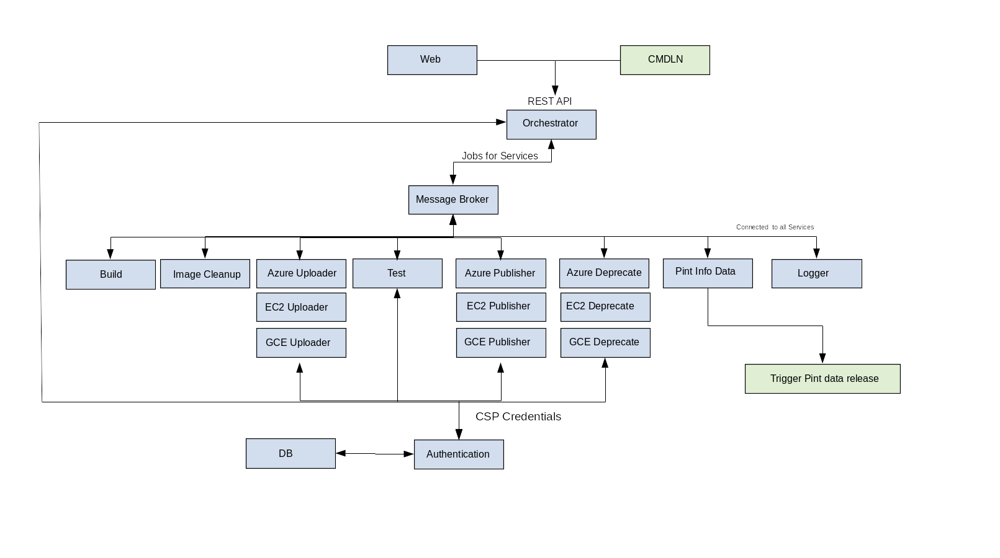

# Release Tool Proposal

## Mash

## Motivation

Releasing and testing images in the public cloud is a time consuming and
manual process. This process needs to be automated to assist the team with
managing the growing number of images. For automation a package is required to
tie together the different CLI tools used by the team.

## Needs

The following steps/tools need automation:

* Build images (OBS/IBS)
* Upload images to cloud provider (ec2uploadimg, azurectl, gcloud)
* Test images (IPA)
* Publish (ec2registerimg/ec2publishimg, azurectl)
* Deprecate (ec2deprecateimg, gcloud, azurectl)
* Pint info (manual update process)

## Overview

Mash will provide the ability to automate the image release process. So
images can be tracked, built, uploaded, tested and released. This will
automagically happen if a new image exists. The frequency of image build will
be configurable per image. Image releases can also be scheduled to auto
release at pre-determined times and all tasks can be manually invoked
for one-off builds.

Mash will utilize a number of independent services to automate the image release
process. The services will handle tasks asynchronously and communicate
messages via a centralized message broker. Each service will maintain it's own
queue to track status of jobs it has received (what's todo, what's active).
There will also be an orchestrator service which will handle new jobs as they
come into the release tool pipeline and hand out tasks as to each service.

## Services

The following independent services are required for mash.

* Authentication
* Orchestrator
* Build
* Image cleanup
* Uploader
* Testing
* Publisher
* Deprecation (tagging)
* Pint data
* Web
* Logging

### Authentication

The auth service will handle user authentication and permissions management.
It will also track CSP account credentials.

* Once authenticated a user can add new CSP accounts. The account credentials
  are only available to that user. By default the user only has access to
  upload/publish images in the accounts he/she provides.
* The service will also provide group permissions. This allows users to join
  a group and have access to and share account credentials.
* The authentication and persistence of account credentials will be managed
  with a DB and all sensitive information will be encrypted for security.

### Orchestrator

The orchestrator service will handle/orchestrate the jobs as they arrive.
It will expose a REST API to the web service and command line for initiating
the jobs.

* The service will communicate new jobs to the services with job config files.
* The specifics of the individual job and configuration information will be
  stored as json and passed via messages.

### Build

The build service tracks projects/images in OBS/IBS for changes. It can
continuously watch for changes or wait until first change. When a new build
is available the service will download the binaries to the NFS mount.
If the project is configured on a condition the service will lock the project
and check the packages for the given condition. If condition is met the image
binaries are retrieved prior to unlocking. This prevents a race condition
where the packages change between check and image retrieval.

For shared images that are not public cloud specific the release tool can be
accessed via API to run IPA tests. This is to confirm image status in the
respective cloud providers. An example is CaaSP where the releases are made
in a new project and therefore the package/project change for each new image.

* The settings for each image/project will be pulled from the job config file.
* Will be a single service but split up into appropriate classes.
* To wait for a new build result the service will use `osc results -w`.
  The watcher threads will have pre-determined timeout when waiting for new
  build result. If a new result is not found before timeout a new thread will
  be spawned to watch the image and the old thread closed. Thus to prevent
  missing a status update when restarting the process.

### Image cleanup

The image cleanup service will remove images based on their respective
life-cycle. The life-cycle will be timestamped on the images. Each project
will have a configurable type which determines life-cycle policy. The types
may be dev, release, release candidate and etc.

* The images will be stored for a given length of time.
* Images will live on an NFS mount for storage.

### {CSP} Uploader

The uploader services takes an image file from the storage location and
uploads it to the respective cloud provider. There will be a separate service
for each cloud provider.

* Uploads image file to provider.
* Creates image based on each provider workflow.
* Handles cleanup of old/stale images in the cloud provider.

### Testing

Tests images using IPA based on a given test suite.

* Run specified suite of tests.
* Notify if image test failure.
** Notification includes failure info instance ID, IP etc. for debugging.
* Stores test history and logs for reference.

### {CSP} Publishing

The publishing services publish and replicate images in each provider.
Similar to the uploader there will be a service for each CSP.

* Publish image and if necessary replicate to all regions.
* Will be able to handle time constraints for publishing.
** I.e. publish image A at 12AM.

### {CSP} Deprecation (tagging)

Similar to the previous CSP services there will be a deprecation service
for each provider to handle image deprecation after a new image is released.

### Pint data

Pint data info service will keep Pint updated with each image release
and deprecation.

### Web

The web service will provide a frontend to the release tool. This will be
lightweight and can be a framework like Flask.

### Logging

The logging service will handle all messages and aggregate the information.

* The service will subscribe to all queues and aggregate logs.
* Logs will contain a job/transaction ID and a service ID.
* Logs will be organized by job ID and ordered properly based on execution
  time.
** That way the flow of a job between services is easily trackable in log
   and any individual log can be traced back to the individual service.

## Layout diagram

